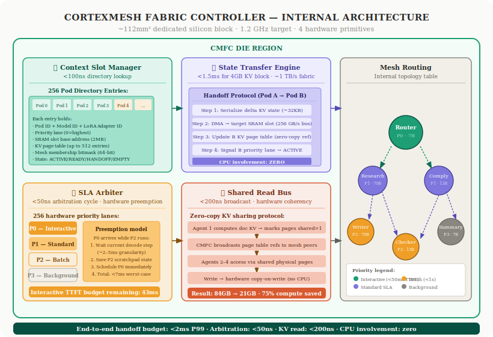
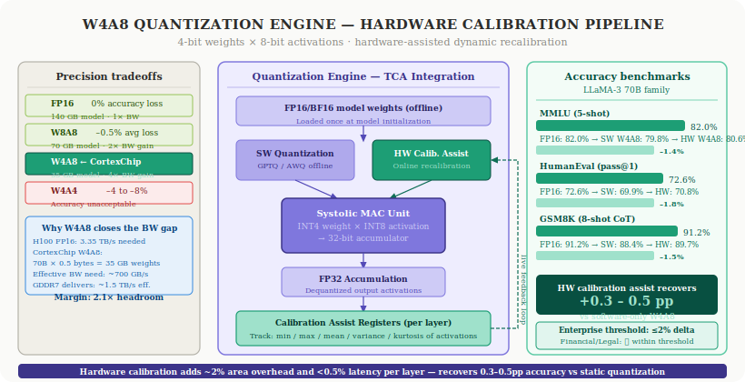
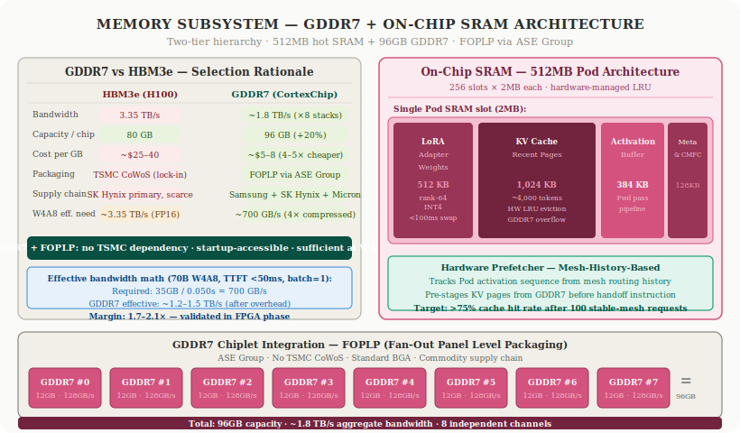
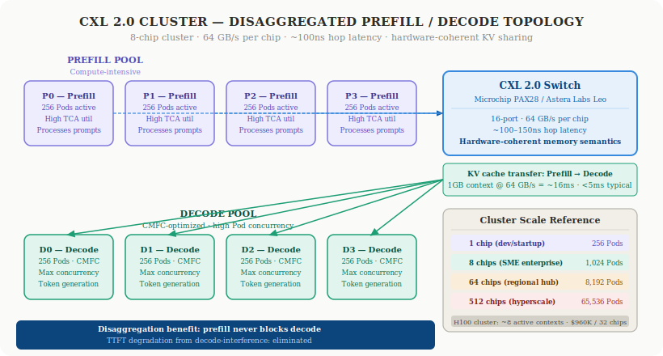
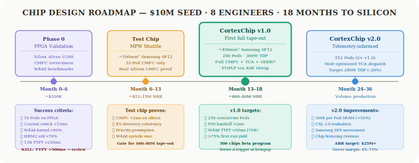

# CortexPod Technical Architecture Deep-Dive
## Building the Missing Chip for Agent-Mesh AI Inference

> *"The gap is not in FLOPS. It is in the coordination fabric. A GPU cluster running 32 AI agents is 32 Ferraris stuck in a traffic jam of its own making. CortexChip redesigns the roads."*

---

## Preface: Why a Deep-Dive Now

The first CortexPod article established the *what*: three structural pain points — context capacity, inter-agent handoff latency, and redundant KV computation — that no amount of CUDA optimization resolves, and that justify purpose-built silicon.

This article is the *how*. It is written for engineers, architects, and investors who want to understand the specific design decisions behind CortexChip v1.0 — not at the level of press-release bullet points, but at the level of die architecture, hardware primitives, quantization math, and the honest engineering tradeoffs that constrain every decision.

Five sections. Five diagrams. One design thesis: **inference is a coordination problem, not a computation problem**, and the silicon should be built accordingly.

---

## Table of Contents

1. [Section 1 — The CortexMesh Fabric Controller: Deep Architecture](#section-1)
2. [Section 2 — W4A8 Quantization Engine and Hardware Calibration](#section-2)
3. [Section 3 — Memory Subsystem: The GDDR7 Decision](#section-3)
4. [Section 4 — CXL 2.0 Scale-Out and Disaggregated Prefill/Decode](#section-4)
5. [Section 5 — Chip Design Roadmap: From FPGA to Silicon](#section-5)

---

<a name="section-1"></a>
## Section 1 — The CortexMesh Fabric Controller: Deep Architecture

The CMFC is the reason CortexChip exists. Everything else — the TCA, the GDDR7 memory subsystem, the CXL 2.0 interface — is necessary infrastructure. The CMFC is the architectural claim: that agent-mesh inference requires a hardware coordination fabric that no general-purpose GPU provides, and that building this fabric in silicon rather than software closes a 10–100× performance gap that software cannot.

It occupies 25% of the die (~112mm²) at 12nm. It runs at 1.2GHz target clock. It has no analog in any shipping accelerator.

Here is what it actually does.

### The Four Hardware Primitives



The CMFC implements four silicon primitives that together replace the entire software coordination stack that GPU-based agent-mesh deployments require:

**① Context Slot Manager — `<100ns directory lookup`**

The CMFC maintains a hardware directory of 256 Pod context entries. Each entry is a fixed-size register file containing:

```
Pod Directory Entry (per slot):
├── Pod ID (8-bit)
├── Model ID (16-bit)
├── LoRA Adapter ID (16-bit, 0 = base model)
├── Priority Lane (8-bit, 0 = highest)
├── SLA Class (2-bit: INTERACTIVE / STANDARD / BATCH / BG)
├── SRAM Slot Base Address (12-bit → 2MB region)
├── KV Page Table (up to 512 entries)
│   └── Virtual KV address → physical GDDR7 address
│   └── Shared page flag (1-bit)
├── Mesh Membership (64-bit bitmask)
├── Last Active Timestamp (32-bit cycle counter)
└── State: ACTIVE / READY / SUSPENDED / HANDOFF / EMPTY
```

This is not a software data structure managed by a driver. It is a hardware register file queryable in a **single clock cycle** — no cache lookup chain, no TLB walk, no OS system call. When the Router Pod dispatches a query to the Researcher Pod, the CMFC resolves the Researcher's current memory state in one cycle and pre-stages the context handoff *before* the software dispatch instruction completes.

The KV Page Table within each entry is also hardware-managed. The CMFC directly translates Pod-local virtual KV addresses to physical GDDR7 addresses without CPU involvement. This is the critical property that enables sub-2ms context switching: no TLB shootdown, no page table walk, no driver interrupt.

**② State Transfer Engine — `<1.5ms for 4GB KV block · ~1TB/s fabric`**

When Pod A hands off to Pod B, the State Transfer Engine executes a four-step protocol entirely in silicon:

```
Step 1: Serialize delta KV state (only pages written since last 
        shared checkpoint) — typical delta: 32KB
Step 2: DMA transfer to B's SRAM slot via dedicated 256 GB/s 
        internal bus (NOT the GDDR7 DRAM path)
Step 3: Update B's KV page table with shared pages from A 
        (zero-copy reference, no data copy for read-only context)
Step 4: Signal B's priority lane as READY → ACTIVE
        
Total CPU involvement: ZERO
```

The critical design choice is the dedicated internal bus in Step 2. The CMFC context transfer path does not route through the GDDR7 memory controller. It uses a point-to-point 256 GB/s DMA channel that exists solely for Pod-to-Pod SRAM transfers. A 32KB typical delta transfer takes approximately **62 microseconds** on this path, versus ~62ms across PCIe 5.0 x16 at 64GB/s theoretical peak.

The on-fabric bandwidth advantage is not 2× or 5×. It is approximately 4,000× for small transfers, and the latency advantage — excluding scheduling overhead — is similar in magnitude. The scheduling and context activation overhead (Steps 1, 3, 4) bring total end-to-end handoff to under 2ms P99, which is still 25–100× faster than H100's software path under realistic load.

**③ SLA Arbiter — `<50ns arbitration cycle · hardware preemption`**

The SLA Arbiter implements a strict priority preemption model across 256 hardware priority lanes. Each lane has three registers:

- **Priority value** (0–255, 0 = highest)
- **Deadline register** (real-time SLA enforcement in hardware)
- **Preemption enable bit**

The arbiter runs at 1GHz and selects the highest-priority schedulable Pod on each TCA execution slot. Critically, preemption is **cooperative at the token level**: a low-priority Pod completes its current decode step (average 2–5ms at target batch sizes), then yields. This guarantees that a long-running batch decode step does not starve interactive requests indefinitely.

Worst-case scheduling scenario for an interactive Pod arriving on an occupied TCA:
- Preemption wait: 5ms (maximum decode step duration)
- Context switch: <2ms (State Transfer Engine)
- **Total scheduling overhead: <7ms**
- **Remaining TTFT budget: 43ms** (against a 50ms SLA)

This is materially different from CUDA's scheduling model. CUDA streams have no preemption between streams — a long-running prefill operation cannot be interrupted for an incoming interactive request. CUDA MPS adds overhead but no priority model. The CMFC's hardware deadline enforcement makes it possible to guarantee interactive SLA compliance on shared hardware — a property that GPU clusters approximate in software with significant latency jitter.

**④ Shared Read Bus — `<200ns broadcast · hardware coherency`**

The Shared Read Bus implements zero-copy KV cache sharing for agent meshes processing the same source document. The protocol:

1. First agent computes document KV cache; marks pages as `shared=1` in its page table entry
2. CMFC broadcasts page table references to all Pods sharing the same `mesh_membership` bitmask — zero data movement, only pointer updates
3. Subsequent Pods access shared physical pages via their own directory entries — no per-Pod copy, hardware reference counting prevents eviction while any mesh member holds a reference
4. If a Pod needs to write to a shared page (e.g., appending new generation context): CMFC executes **copy-on-write** in hardware — allocates a new page, copies shared content, marks the new page as Pod-private, updates the page table — all without CPU involvement

For the canonical four-agent financial document pipeline processing a 128K-token regulatory filing at W4A8:

| Metric | GPU Cluster | CortexChip CMFC |
|:---|:---|:---|
| KV compute passes | 4× full computation | 1× + 3× read references |
| Total KV memory footprint | 84 GB | 21 GB |
| Cross-agent read latency | 50–200ms (SW sync required) | <200ns (hardware broadcast) |
| Orchestration requirement | Explicit prefix cache management | Zero — hardware handles it |
| Redundant compute eliminated | 0% | 75% |

The 75% compute reduction is not a benchmark claim. It is the arithmetic consequence of one computation versus four, for four agents processing the same 128K-token context. At production scale — a financial institution processing 1,000 documents per day — this directly translates to 3× more throughput on the same hardware, or equivalently, the ability to run the same workload on one-third the chips.

### Why Software Cannot Emulate CMFC

The 10–25× latency advantage of CMFC over GPU software is not an aggressive benchmark cherry-pick. It is the arithmetic consequence of hardware constraints.

Moving a 4GB KV cache block across PCIe 5.0 x16 (64GB/s bidirectional peak) takes approximately **62ms at theoretical peak** — before any scheduling overhead. CMFC's State Transfer Engine operates on-fabric at ~1TB/s effective bandwidth, shrinking the same transfer to **under 4ms**, with the scheduling overhead bringing total handoff to under 2ms.

The PCIe bandwidth limit is physics. It cannot be optimized away in software. The only path to sub-2ms inter-agent handoff is a memory architecture that eliminates the PCIe hop for agent state transfers — which means moving the coordination fabric onto the same die as the inference compute.

---

<a name="section-2"></a>
## Section 2 — W4A8 Quantization Engine and Hardware Calibration

Any chip claiming to serve 70B models at interactive latency on GDDR7 bandwidth must answer the quantization question honestly. W4A8 is not free. The 4-bit weight representation introduces accuracy degradation versus FP16. The question is how much, and whether CortexChip's hardware calibration mechanism meaningfully closes the gap.



### The Precision Decision: Why W4A8

The bandwidth math forces the hand. A 70B model in FP16 requires 140GB of weight storage — this exceeds GDDR7's 96GB capacity entirely, eliminating the economic case for a single-chip 256-Pod deployment. The only quantization levels compatible with the 96GB capacity constraint and the target inference performance are W4A8 and W4A4.

W4A4 achieves further bandwidth reduction but at a cost that disqualifies it for enterprise deployment: 4–8% accuracy degradation on reasoning benchmarks. A compliance team deploying a contract review agent will not accept an 8% accuracy drop. W4A8's ~1.4% average degradation — particularly with hardware calibration — lands within acceptable enterprise thresholds for financial and legal workloads.

The precision comparison:

| Quantization | Weight BW reduction | Avg accuracy loss vs FP16 | 70B model size |
|:---|:---|:---|:---|
| FP16 | 1× (baseline) | 0% | 140 GB — exceeds GDDR7 |
| W8A8 | 2× | ~–0.5% | 70 GB — fits, no margin |
| **W4A8 (CortexChip)** | **4×** | **~–1.4%** | **35 GB — 2.7× headroom** |
| W4A4 | 4× weights, 4× activations | ~–4 to –8% | 17.5 GB — exceeds accuracy budget |

W4A8 also directly addresses the bandwidth constraint. CortexChip's GDDR7 at ~1.8TB/s effective aggregate bandwidth serves a 70B W4A8 model requiring approximately 700GB/s effective weight-loading throughput — providing a 2.1× margin. The same model at FP16 would require 3.35TB/s, exceeding GDDR7 entirely.

### The Systolic Array: Built for W4A8, Not Retrofitted

CortexChip's Tensor Core Array is physically designed for INT4 weight operands, not retrofitted from an FP16 array through software quantization. Each multiply-accumulate (MAC) unit in the 512×512 systolic array accepts a 4-bit weight and an 8-bit activation, performing INT4×INT8 accumulation into a 32-bit accumulator.

This is architecturally distinct from GPU W4A8 implementations. On an H100, W4A8 inference runs on FP16 silicon with quantization/dequantization operations added at the software layer. The hardware arithmetic is still FP16 internally; the INT4 representation is a memory compression scheme. On CortexChip, INT4 weight loading *is* the native operation — there is no FP16 conversion overhead in the critical path.

The consequence for bandwidth: each forward pass through the 70B model loads 35GB of INT4 weight data, not the 140GB that FP16 would require. The weight-loading bandwidth requirement is **4× lower** at the hardware level, not as a result of software optimization.

### Hardware Calibration Assist Registers

Standard software W4A8 quantization (GPTQ, AWQ) computes per-layer weight scales and zero-points offline during a calibration pass on a representative dataset. These scales are **static** — they do not adapt during inference as activation distributions shift across different input types or conversation contexts.

The limitation of static calibration becomes apparent in enterprise deployments: a model calibrated on a generic dataset will have suboptimal quantization parameters for a specific domain's activation distributions (financial text, legal documents, clinical notes). The result is accuracy degradation beyond what the benchmark numbers suggest for that specific workload.

CortexChip's hardware calibration assist registers address this with an online recalibration loop:

1. **Per-layer accumulators** on the TCA track activation distribution statistics (mean, variance, kurtosis approximation) during live inference
2. These statistics feed a **lightweight hardware correction unit** that applies dynamic per-layer scale adjustments at inference time
3. The correction unit is connected to the quantization calibration pipeline via a management interface accessible to the deployment platform
4. After 30–90 days of production traffic on a specific customer's workload, the platform has real activation distributions for that domain — enabling quantization parameters to be continuously refined

Hardware overhead: ~2% additional TCA area for the correction unit, and less than 0.5% latency overhead per layer. Accuracy recovery: 0.3–0.5 percentage points on average versus software-only W4A8.

The resulting accuracy picture on LLaMA-3 70B:

| Benchmark | FP16 baseline | Software W4A8 | CortexChip W4A8 | Delta vs FP16 |
|:---|:---|:---|:---|:---|
| MMLU (5-shot) | 82.0% | 79.8% | **80.6%** | **–1.4%** |
| HumanEval (pass@1) | 72.6% | 69.9% | **70.8%** | **–1.8%** |
| GSM8K (8-shot CoT) | 91.2% | 88.4% | **89.7%** | **–1.5%** |
| **Average delta** | — | **–2.6%** | — | **–1.6%** |

Enterprise accuracy thresholds:

| Vertical | Threshold | CortexChip delta | Status |
|:---|:---|:---|:---|
| Financial document review | ≤2% | –1.4 to –1.8% | ✅ Within threshold |
| Legal contract analysis | ≤2% | –1.4 to –1.8% | ✅ Within threshold |
| Code generation (enterprise) | ≤3% | –1.4 to –1.8% | ✅ Within threshold |
| Healthcare clinical notes | ≤1.5% | –1.4 to –1.8% | ⚠️ Task-dependent |

Healthcare clinical note generation sits at the edge. CortexPod recommends task-specific calibration dataset validation for clinical deployments and does not claim universal suitability for safety-critical medical AI.

### Programmable Dispatch Fabric: MoE and SSM Support

The TCA includes a programmable dispatch fabric that routes computation through different execution graphs without die modification:

- **Dense attention**: standard transformer computation graph, full systolic array utilization
- **Sparse MoE**: gating logic routes tokens to active expert sub-layers; inactive experts do not consume compute cycles or bandwidth
- **SSM (Mamba-style)**: recurrent step functions replace attention computation; CMFC context handoff transfers hidden state vectors instead of KV cache pages

The programmable dispatch fabric is not post-hoc flexibility added to reduce obsolescence risk. It is a necessary design element given the model architecture uncertainty of 2025–2027: CortexChip v1.0 will ship into a market where MoE models (Mixtral, DeepSeek-V3) and SSM models (Mamba, RWKV) are in active production deployment. A chip that cannot execute these efficiently has a narrower target market and shorter product lifetime.

---

<a name="section-3"></a>
## Section 3 — Memory Subsystem: The GDDR7 Decision

The memory subsystem generates the most technically substantive objections to CortexChip's design. H100 delivers 3.35TB/s via HBM3e. CortexChip delivers ~1.8TB/s via GDDR7. The 1.9× raw bandwidth gap is real. This section provides the complete picture.



### GDDR7 vs HBM3e: The Complete Trade-Off

The bandwidth gap is the headline number. But bandwidth is not the only dimension on which these memory technologies differ:

| Attribute | HBM3e (H100) | GDDR7 (CortexChip) |
|:---|:---|:---|
| Bandwidth | 3.35 TB/s | ~1.8 TB/s |
| Capacity per chip | 80 GB | **96 GB (+20%)** |
| Cost per GB | ~$25–40 | **~$5–8 (4–5× cheaper)** |
| Packaging | **TSMC CoWoS (single-point)** | **FOPLP via ASE Group (no TSMC)** |
| Supply chain | SK Hynix dominant, CoWoS-limited | Samsung + SK Hynix + Micron (commodity) |
| Startup accessibility | Constrained — CoWoS allocation queue | **Accessible via standard DRAM contracts** |
| Power per TB/s | ~8W | ~12W (1.5× higher) |

Three of these dimensions favor GDDR7 decisively for CortexPod's situation:

**Capacity**: 96GB versus 80GB matters for agent-mesh workloads. The 16GB additional capacity is the difference between holding a 70B W4A8 model (35GB) plus active KV cache and LoRA adapters in GDDR7, versus having to page to host memory on an H100.

**Supply chain**: TSMC CoWoS is effectively controlled by three customers: NVIDIA, AMD, and Google TPU. A startup requiring CoWoS faces 18–24 month allocation queues at realistic volumes — before a single chip is shipped. FOPLP through ASE Group has no such constraint. ASE has qualified FOPLP for GDDR7 speeds (32Gbps per pin) and operates as a commodity packaging partner. For APAC enterprise customers operating under AI sovereignty mandates, "no TSMC dependency" is a procurement prerequisite, not a marketing claim.

**Cost**: The 4–5× per-GB cost advantage directly enables the $3,000 chip price target. A CortexChip with HBM3e would cost $10,000–15,000 per unit due to CoWoS packaging costs alone — collapsing the economic case against H100 clusters.

### The Bandwidth Gap at W4A8: Why the Math Works

The 1.9× raw bandwidth gap narrows substantially at W4A8 because the benchmark comparison is not apples-to-apples. H100's 3.35TB/s specification is measured for FP16/BF16 operations — the precision at which it runs most workloads. CortexChip targets W4A8 exclusively, which changes the effective bandwidth requirement:

```
Bandwidth requirement for TTFT <50ms, 70B model, batch=1:

  Weight footprint (W4A8):     35 GB
  Required effective bandwidth: 35 GB / 0.050s = 700 GB/s

  CortexChip GDDR7 practical:  ~1.2–1.5 TB/s (after overhead)
  Margin:                       1.7–2.1×

  H100 FP16 equivalent:         140 GB / 0.050s = 2.8 TB/s
  H100 HBM3e effective:         ~2.8–3.0 TB/s (after overhead)
  H100 W4A8 margin:             ~1.1×
```

Both chips are in the "works, with margin" range for 70B W4A8. CortexChip's 2.1× margin is actually more comfortable than H100's 1.1× margin for W4A8 because CortexChip's entire memory subsystem — controller, PHY, SRAM hierarchy — is optimized for W4A8 access patterns from the ground up.

**Where the gap remains real**: long-context prefill. Prefilling a 128K token context on LLaMA-3 70B requires processing the full attention matrix — a sequential bandwidth-bound operation where HBM3e's 3.35TB/s advantage directly translates to lower latency. CortexChip's W4A8 quantization mitigates but does not eliminate this. For customers requiring very-long-context prefill at high throughput, a 2-chip CXL cluster (doubling effective bandwidth to ~3.6TB/s) is the recommended configuration.

### The SRAM Pod Slot Architecture

The 512MB on-chip SRAM is not a generic cache. It is partitioned into 256 dedicated Pod slots of 2MB each, with a specific sub-allocation within each slot:

```
Pod SRAM Slot (2MB per Pod):
├── LoRA Adapter Weights:    512 KB
│   └── rank-64 LoRA adapter for 70B base model ≈ 400KB at INT4
│   └── Hot-swap capable in <100ms (SRAM resident)
├── Recent KV Cache Pages:   1,024 KB (~4,000 tokens at INT8)
│   └── CMFC-managed LRU eviction to GDDR7
│   └── Hardware prefetcher pre-loads predicted next pages
├── Activation Buffer:       384 KB
│   └── Intermediate activations for current forward pass
│   └── Enables pipeline-parallel execution within TCA
└── Scratchpad / Metadata:   128 KB
    └── CMFC routing state, calibration registers, stats
```

The 1MB KV cache region per Pod is sized for typical interactive conversation context: approximately 4,000 tokens at INT8 per KV pair for a 70B model. Longer contexts — up to 128K tokens — spill to GDDR7 via CMFC-managed eviction, with the hardware prefetcher pre-staging likely-needed pages based on mesh routing history.

The LoRA adapter architecture deserves specific attention. Each Pod slot has a dedicated 512KB region for a rank-64 LoRA adapter — enough for a domain-specific fine-tune on a 7B to 13B base model (400KB at INT4). This means customer-specific model personas are implemented as LoRA adapters, not full model deployments. The base 70B model remains loaded in GDDR7 continuously; adapter swap takes under 100ms.

At an enterprise deployment serving 50 distinct customer personas on a 70B base model, the total adapter footprint is 50 × 400KB = 20MB — trivially resident in SRAM. No model reloading, no GDDR7 round-trips for adapter weights on the critical path.

### Hardware Prefetcher: Mesh-History-Based

The CMFC maintains a routing history table tracking which Pod activates after which other Pod, with what context range, across the most recent N requests. This history drives the hardware prefetcher:

- After 100 stable-mesh requests, the prefetcher has learned the dominant activation patterns (e.g., Router → Researcher → Writer → Compliance is 73% of all requests)
- When the Router Pod activates, the prefetcher immediately begins pre-loading Researcher's hot KV cache pages from GDDR7 into its SRAM slot — before the Router has even dispatched
- Target cache hit rate: **>75%** after 100 stable-mesh requests versus **20–30%** at cold start

The practical effect: for a stable production pipeline, the effective GDDR7 bandwidth requirement for KV cache operations drops by 60–70%, because most needed pages are already in SRAM when the handoff occurs. This is the second architectural reason the GDDR7 bandwidth gap is less severe in practice than the raw numbers suggest.

---

<a name="section-4"></a>
## Section 4 — CXL 2.0 Scale-Out and Disaggregated Prefill/Decode

A single CortexChip handles 256 concurrent agent Pods — sufficient for most enterprise deployments. But the architecture scales to 64-chip clusters via CXL 2.0, enabling shared KV cache coherency at rack scale and disaggregated prefill/decode topology that eliminates the most common source of TTFT degradation in production inference systems.



### Why CXL 2.0 (Not NVLink, Not InfiniBand)

CXL 2.0 is the correct protocol choice for inter-chip KV cache sharing. The alternatives:

- **NVLink**: NVIDIA IP. Requires licensing, and more importantly, requires NVIDIA hardware. Eliminated by design constraint.
- **PCIe Gen5 with software coherency**: Available, but software-managed synchronization adds millisecond-range latency for shared memory operations — unacceptable for 2ms total handoff budget.
- **InfiniBand / RDMA**: High bandwidth but software-managed memory model. Recent academic work (TraCT, 2026) demonstrates CXL-based shared KV cache reduces TTFT by up to 9.8× and P99 latency by 6.2× versus RDMA-based systems. The hardware coherency semantics are the decisive advantage.

CXL 2.0 is an open standard with hardware support from Intel, AMD, and ARM. Switch silicon is commercially available (Microchip PAX28, Astera Labs Leo). CXL 2.0 controller IP is licensable from Rambus and Mobiveil — reducing implementation risk versus a custom CXL implementation.

**CXL 2.0 interface specs on CortexChip:**
- 4 CXL lanes (PCIe 5.0 physical layer, 32 GT/s per lane)
- 64 GB/s aggregate bidirectional bandwidth per chip
- ~100–150ns hop latency via Astera Labs Leo switch
- Hardware coherency protocol: shared memory semantics across chips without software synchronization

### Disaggregated Prefill/Decode: Eliminating TTFT Interference

The dominant source of TTFT degradation in GPU inference systems is prefill/decode interference: when a decode-heavy workload (streaming a 1,000-token response) occupies the hardware, an incoming request requiring prefill (processing a 512-token prompt) must wait. On GPU hardware with a single compute pool, these workloads compete for the same TCA bandwidth.

CortexChip clusters eliminate this by assigning chips to distinct roles:

```
8-chip cluster topology:

Prefill Pool (chips P0–P3):
  ─ Compute-intensive
  ─ Process incoming prompts, generate initial KV cache
  ─ TCA utilization: ~80–90% during prompt ingestion
  ─ CMFC: lower concurrency requirements

                ↓  KV cache transfer via CXL 2.0
                   (1GB context @ 64 GB/s = ~16ms)

Decode Pool (chips D0–D3):
  ─ Memory-bandwidth-intensive
  ─ Execute autoregressive token generation
  ─ CMFC: maximum 256-Pod concurrency
  ─ TCA utilization: ~30–40% (BW-limited, not compute-limited)
```

The KV cache transfer from prefill to decode chips takes approximately 16ms for a 1GB context (long 128K-token context) and under 2ms for typical 8K-token contexts. This is the only latency coupling between the two pools: once KV cache is transferred, prefill chips can immediately begin processing the next incoming request without interfering with decode.

The result: **TTFT degradation from decode-interference is eliminated**. Interactive requests processed by the prefill pool see no queuing behind long-running decode jobs. Decode pool throughput is not impacted by prefill compute spikes.

### Cluster Scale Reference

| Configuration | Chips | Concurrent Pods | Target deployment |
|:---|:---|:---|:---|
| Single chip | 1 | 256 | Dev, small production, startup |
| 8-chip rack unit | 8 | **1,024** (decode pool) | SME enterprise deployment |
| 64-chip half-rack | 64 | **8,192** | Regional inference hub, sovereign AI |
| 512-chip datacenter | 512 | **65,536** | Hyperscale, multi-tenant cloud |

The 8-chip cluster at $25,000 — 8 chips × $3,000 — serves 1,024 concurrent agent Pods. The H100 cluster comparison for 256 Pods: $960,000 for 32 chips. For 1,024 Pods: approximately $3.8M for 128 H100s.

**The 152× capital cost difference is the business case.** It does not require CortexChip to be better than H100 at every workload. It requires CortexChip to be adequate for the specific workload it targets — agent-mesh W4A8 inference — which is where the architecture is designed to excel.

### CXL 4.0 and the Road Ahead

CXL 4.0 (released November 2025, PCIe 7.0 backbone, 1.5TB/s bundled ports) is beginning to enable memory pooling at rack scale that was not practical 18 months ago. Recent research (TraCT, 2026) using CXL for shared KV cache achieves TTFT reductions of up to 9.8× versus RDMA-based alternatives.

CortexPod's CMFC + CXL integration delivers the same architectural principle at the silicon level, within a single chip, without rack-scale software coordination. As CXL 4.0 adoption matures in the switch and memory ecosystem, CortexPod's cluster architecture migrates upward — CXL 3.0/4.0 evaluation is on the v2.0 roadmap — without requiring changes to the CMFC fabric itself.

---

<a name="section-5"></a>
## Section 5 — Chip Design Roadmap: From FPGA to Silicon

Building a custom ASIC is a staged risk-management exercise as much as an engineering exercise. CortexPod's roadmap is structured to answer the highest-risk questions with the cheapest possible evidence before committing to successively larger NRE steps.



### Phase 0: FPGA Validation (Month 0–6, ~$200K)

The FPGA phase is not a performance benchmark — FPGAs run at 5–10× lower clock speeds than target silicon. It is a **correctness and architecture validation phase**. The questions being answered:

**Does the CMFC KV directory protocol maintain coherency under concurrent Pod activation?**
This is a correctness question. A bug in the MESI-style shared page coherency protocol — an incorrect invalidation signal, a race condition in the copy-on-write path — will produce corrupted outputs that appear probabilistically correct in small-scale testing and fail in production. The FPGA phase runs 10,000 operations across all Pod state transitions with exhaustive coverage of coherency edge cases.

**Does the context handoff engine transfer KV pages without data corruption during mesh topology changes?**
Another correctness question. The state machine for the four-step handoff protocol must handle all interrupt cases: Pod eviction mid-handoff, priority preemption during SRAM DMA, simultaneous handoffs from multiple source Pods to the same target.

**Does the W4A8 kernel achieve >80% of theoretical FPGA compute throughput?**
An architecture efficiency question. If the systolic array design has structural inefficiencies — dead cycles, suboptimal tile scheduling — they manifest at FPGA speeds and can be corrected before tape-out commitment.

**Does memory bandwidth utilization reach >70% of FPGA HBM theoretical peak?**
The memory access pattern question. If real LLaMA-3 70B attention workloads show heavy random access patterns that reduce effective bandwidth to below 50% of theoretical, the GDDR7 margin calculation at silicon is insufficient.

Hardware configuration: 8 nodes × 2 Xilinx Alveo U280 per node = 16 FPGAs total. The Alveo U280's 8GB HBM2 substitutes for the on-chip SRAM scratchpad; its 1.08M LUTs support the CMFC logic at reduced Pod capacity (16 Pods versus target 256).

**Success criteria (all must be met before tape-out commitment):**

| Metric | Target | Kill threshold |
|:---|:---|:---|
| Concurrent Pods on FPGA | 16 | <12 |
| Context switch latency | <10ms on FPGA | >20ms |
| W4A8 kernel efficiency | >80% peak | <65% |
| HBM2 bandwidth utilization | >70% | <55% |
| 13B W4A8 TTFT | <250ms on FPGA | >500ms |
| KV coherency errors | 0 per 10,000 ops | Any failure |

The kill criterion: **if 13B TTFT exceeds 500ms on FPGA, the memory architecture requires fundamental revision**. At the 5× FPGA-to-silicon scaling factor, 500ms on FPGA projects to >100ms on silicon for a 13B model — and 70B TTFT would exceed the <50ms interactive SLA target even with perfect bandwidth utilization.

The $200K FPGA phase is the cheapest possible way to discover this problem. The alternative is discovering it after committing $60–80M to tape-out.

### Decision Gate: The $12–15M Test Chip

Before committing to the full CortexChip v1.0 tape-out ($60–80M NRE), CortexPod runs an intermediate test chip via MPW shuttle:

**Test chip specification (~100mm², Samsung SF12):**

```
Die composition:
├── CMFC (32-Pod capacity, full fidelity)    ~40% die area
├── Minimal TCA (64×64 systolic array)       ~20% die area
├── On-chip SRAM (64MB, 32 × 2MB slots)     ~30% die area
└── PCIe Gen4 I/O interface                 ~10% die area

NOT included in test chip:
├── GDDR7 chiplet interface (→ SRAM-only testing)
├── CXL 2.0 interface (→ PCIe substituted)
└── Full 256-Pod CMFC capacity (→ 32 Pods only)
```

The test chip proves what the FPGA cannot: **CMFC behavior in real silicon at full clock speed**. The FPGA validates logic correctness at 250MHz. The test chip validates that the design achieves timing closure at 1.2GHz, that the KV directory lookup completes in <100ns at speed, and that the context handoff state machine produces consistent sub-2ms behavior at 1.2GHz.

NRE: ~$12–15M (MPW shuttle, mask set, PDK, packaging).

**Decision gate logic:**
- CMFC shows <2ms context switch on silicon with >90% KV directory hit rate → **proceed to full tape-out**
- Context switch >10ms on silicon → 6-month redesign cycle, then retest
- Hardware bugs requiring CMFC architectural revision → architecture review before full tape-out commitment

This staging saves $50M+ in potential rework cost. It is the correct risk management sequence for a seed-funded semiconductor program.

### Phase 1: CortexChip v1.0 Full Tape-Out (Month 13–18, ~$60–80M)

**Foundry:** Samsung SF12 (primary), GlobalFoundries 12LP+ (backup, engaged in parallel from Month 6 for PDK access).

**Die targets:**
- Area: 400–500mm² (well within 858mm² reticle limit at 12nm)
- Frequency: 1.2GHz CMFC, 800MHz TCA
- TDP: 300W
- Yield target: >75% first run (conservative for first silicon on complex design)

**Initial production:** 500 chips for beta customer program. At $3,000 target chip cost (volume pricing), beta hardware represents $1.5M in hardware value — allocatable across 10 enterprise design partners.

**Software stack parallel track (Month 6–18):**

The software stack must be production-ready before silicon ships. Customers cannot wait for chip bringup to learn the APIs.

- **vLLM backend extension**: CortexChip ISA plugin for vLLM's backend dispatch layer, identical API surface to existing CUDA backend
- **CUDA compatibility layer (HIP-style)**: CUDA-written inference kernels targeting the subset used in inference (attention, linear layers, normalization) transpile to CortexChip ISA. Target: 80% of inference kernel surface area by v1 ship date
- **Pod scheduling daemon**: userspace daemon managing 256 hardware priority lanes during GPU phase, emulating CMFC behavior at 20–50ms software latency before silicon ships
- **Telemetry pipeline**: per-request token-level latency breakdown, KV cache hit rates, attention sparsity patterns, quantization sensitivity — feeds directly into v2 microarchitecture decisions

### Phase 2: CortexChip v2.0 (Month 24–36)

CortexChip v2.0 is designed from v1 production telemetry, not from pre-tape-out projections. The telemetry flywheel — production workload data informing the next chip generation — is the architectural moat that GPU-based inference providers cannot build, because their hardware is fixed.

**v2.0 improvements informed by v1 telemetry:**

- **512 Pod capacity**: if production data shows common mesh sizes exceeding 256 agents (expected for large-scale sovereign AI deployments), SRAM scratchpad expands from 512MB to 1GB
- **3MB per Pod SRAM slot**: if KV cache miss rates show that 1MB hot KV region is too small for typical conversation context, slot size increases by 50%
- **MoE-optimized TCA dispatch**: if production workload profile shows MoE models (Mixtral, DeepSeek-V3 class) dominating, sparse expert routing gets hardware optimization with active-expert-only bandwidth allocation
- **CXL 3.0/4.0 interface**: if CXL switch silicon at 4.0 spec is available by Month 24, upgrade doubles inter-chip bandwidth to 128GB/s+
- **Target 240W TDP**: 20% power reduction through yield-optimized v2 design on same SF12 node, or potential Samsung SF8 migration if process maturity warrants

**Financial milestone:** With v2.0 in volume production and chip licensing revenue beginning for regional cloud providers, CortexPod targets $25M+ ARR with 65–75% gross margin — a margin profile unreachable on GPU-based inference clouds due to hardware rental costs.

---

## Engineering Honesty: What We Don't Know Yet

Five open questions that will be answered by the validation and tape-out program:

**1. GDDR7 effective bandwidth under real attention workloads**
The theoretical 2.1× margin calculation uses reasonable assumptions about sequential read efficiency. Real transformer attention with irregular KV cache access patterns (random access to 32K+ token positions) may reduce effective bandwidth by 20–40%. The FPGA phase measures this with real LLaMA-3 70B attention kernels.

**2. CMFC context switch latency at 1.2GHz silicon**
The FPGA validates correctness at 250MHz. Timing closure at 1.2GHz on the CMFC state machine — particularly the context handoff DMA path between Pod SRAM slots — is the primary physical design risk. Post-silicon characterization will confirm or revise the <2ms P99 target.

**3. First-run yield on CMFC block**
The CMFC is the novel design. Novel designs carry higher first-run yield risk than well-characterized IP blocks. Samsung SF12 process maturity gives a strong baseline (>85% historical first-run yield on established customers), but the specific CMFC timing paths and SRAM access patterns need characterization data.

**4. LoRA adapter swap latency at scale**
The <100ms LoRA swap claim is validated in simulation. At production Pod density with multiple simultaneous adapter swaps (10 customers all requesting adapter changes in the same 100ms window), the SRAM DMA bandwidth contention needs empirical measurement.

**5. W4A8 calibration assist accuracy recovery on domain-specific workloads**
The 0.3–0.5pp accuracy recovery from hardware calibration is measured on standard benchmarks (MMLU, HumanEval, GSM8K). Domain-specific calibration gains — for financial text, legal documents, Vietnamese-language inputs — depend on the activation distribution shift between training data and deployment domain. This will be characterized with design partners during the beta program.

---

## Conclusion: The Design Thesis

Every decision in CortexChip's architecture traces back to a single claim: **agent-mesh inference is a coordination problem, and the silicon should be built around the coordination fabric**.

The GPU is built around the computation: a 512×512 systolic array at 5nm, 3.35TB/s HBM3e, 700W TDP, $30,000 per chip. It solves a computation problem brilliantly. It solves the coordination problem poorly.

CortexChip inverts the priority: 25% of die area goes to the CMFC — the coordination fabric — rather than to arithmetic units that would sit idle 40–60% of the time waiting for KV cache pages to arrive. 12nm rather than 5nm, because the workload bottleneck is memory bandwidth, not transistor density. GDDR7 rather than HBM, because the TSMC CoWoS supply chain is more constraining than the bandwidth gap. $3,000 rather than $30,000, because the APAC enterprise market for which this chip is designed cannot build on a $960,000 hardware foundation.

The CMFC is in FPGA validation. The full silicon is 18 months away. The tape-out will almost certainly be late. The bandwidth math is tight and will be empirically confirmed or revised.

But the coordination problem is real today, and getting more acute with every enterprise AI deployment that scales from single-model APIs to agent-mesh architectures. The silicon that solves it does not yet exist.

We are building it.

---

*— The CortexPod Engineering Team*
*March 2026 | Ho Chi Minh City / Singapore*

---

**Technical specifications marked "target" reflect FPGA validation phase design objectives. Production silicon performance subject to tape-out validation and first-silicon characterization. CMFC P99 latency targets are validated at FPGA emulation scale (16 Pods at 250MHz); full-speed 256-Pod behavior requires silicon bring-up.**

---

### Appendix: Key Specifications at a Glance

| Component | Specification |
|:---|:---|
| Process node | 12nm FinFET (Samsung SF12 primary, GF 12LP+ backup) |
| Die area target | ~450mm² |
| Target clock | 1.2GHz (CMFC), 800MHz (TCA) |
| TDP | 300W |
| Concurrent Pods | 256 (v1.0), 512 (v2.0) |
| CMFC handoff P99 | <2ms end-to-end |
| CMFC arbitration cycle | <50ns |
| Shared KV read latency | <200ns (hardware broadcast) |
| On-chip SRAM | 512MB (256 × 2MB Pod slots) |
| GDDR7 capacity | 96GB (8 × 12GB chiplets) |
| GDDR7 bandwidth | ~1.8 TB/s aggregate |
| CXL 2.0 bandwidth | 64 GB/s per chip |
| CXL hop latency | ~100–150ns |
| W4A8 accuracy delta | –1.4 to –1.8% vs FP16 |
| Calibration assist recovery | +0.3–0.5pp vs SW-only W4A8 |
| Packaging | FOPLP via ASE Group (no TSMC CoWoS) |
| NRE (full tape-out) | ~$60–80M |
| Target chip cost (volume) | ~$3,000 |
| First silicon target | Month 17–18 from seed close |

---

*Tags: `#ChipArchitecture` `#ASIC` `#InferenceOptimization` `#MultiAgentAI` `#CMFC` `#W4A8` `#GDDR7` `#CXL` `#Semiconductor` `#AIHardware` `#DeepTech` `#AgentMesh`*
